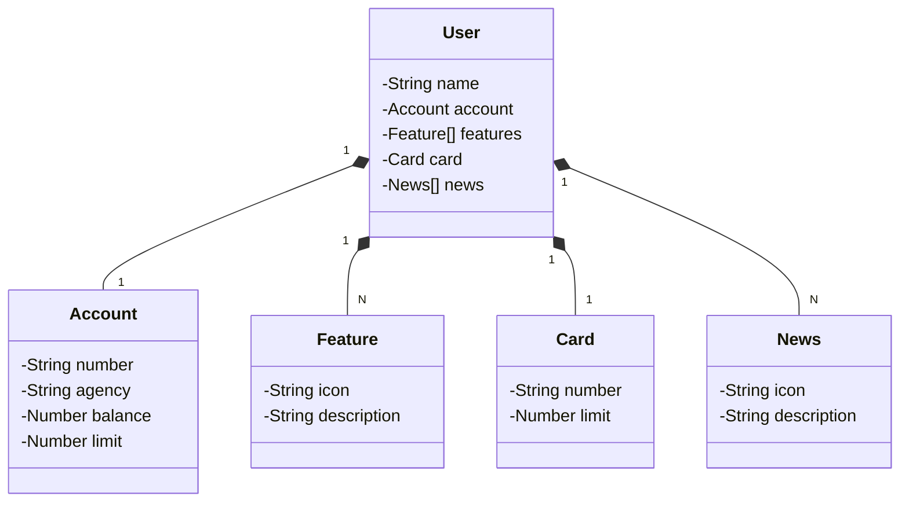

## Solving the DIO Santander Dev Week challenge

- [x] link to entire challenge description [here](https://web.dio.me/lab/publicando-sua-api-rest-na-nuvem-usando-spring-boot-3-java-17-e-railway/learning/ad7b622c-6ca0-4000-bf7b-2939591221ed)

- [x] challenge proposed by [falvojr](https://github.com/falvojr)

## Documentation with OpenAPI (Swagger)

build made with RAILWAY and available at the URL below

```agsl
https://newbank-dio.up.railway.app/swagger-ui/index.html
```

## Installation

1. Clone the repository:

```bash
git clone https://github.com/mdsjjorge/dio-challenge-newBank.git
```

2. Install dependencies with Gradle
3. Create the database "newBank" on Postgres SGDB


## Usage

1. Start the application with Gradle or IntelIDEA
2. The API will be accessible at http://localhost:8080

## Stacks

1. Spring Boot 3.1.4
2. Java 17
3. Gradle
4. Postgres
5. OpenAPI (Swagger)
6. Railway

## Class Diagram

